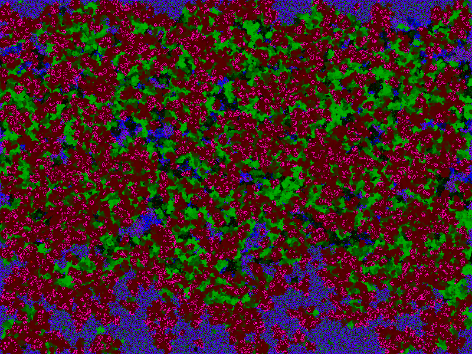

# graffito

A small stencil framework for quick design and visualization.

Requires [Futhark](http://futhark-lang.org) and SDL2 and SDL2-ttf
libraries with associated header files.

## Building and running

First run `futhark pkg sync` once.

Then run `make` to build all programs.

The programs go in the `bin` directory:

- `bin/template`: A small template with comments in order to get started.
- `bin/steal`: An area-stealing algorithm, kind of.
- `bin/routefinder`: Visualize route finding.
- `bin/gameoflifeprob`: A probabilistic Game of Life.
- `bin/gameoflife`: A very basic, no-frills implementation of Game of Life.
- `bin/closingframe`: A growing black frame around a square of colors.
- `bin/diamonds`: Growing diamonds.
- `bin/consistencyfier`: Not sure yet.
- `bin/lines`: Scraggly lines.
- `bin/producerconsumer`: Glittering small movements.
- `rain`: Blue, long droplets.
- `collatz`: A quiet sea (takes a while to get started).
- `gravity`: A simple implementation of gravity as we know it.  Can
  require multiple passes of the stencil.

Pass `--help` to any program to see which options can be changed.

Controls in the visualizations:

- Space: Pause
- S: Step once
- R: Reset

## Adding stencils

- Create a new directory under `stencils/` with a `stencil.fut` file and
  a Makefile.
- Extend the root `Makefile`.

## MEGAGRAFFITO

See also the [MEGAGRAFFITO](./MEGAGRAFFITO) subdirectory for a single
program containing all the stencils (not built by default).
